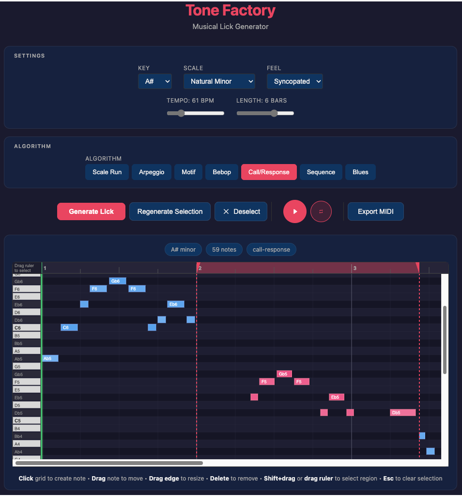

# Tone Factory

A browser-based musical lick and melody generator with a piano roll editor, audio preview, and MIDI export.



## Features

- **Smart Generation Algorithms** - Seven procedural generators based on music theory

  | Algorithm | Description |
  |-----------|-------------|
  | **Scale Run** | Ascending and descending melodic lines following the selected scale with smooth contour |
  | **Arpeggio** | Chord-tone based patterns that outline harmonies with musical movement |
  | **Motif** | Generates a short musical idea then develops it with transposition, inversion, and rhythmic variation |
  | **Bebop** | Jazz vocabulary with chromatic approach notes and enclosures targeting chord tones on strong beats |
  | **Call/Response** | Musical conversation with question phrases answered by echo, mirror, or resolving responses |
  | **Sequence** | A melodic pattern (turn, mordent, arch) transposed stepwise through the scale |
  | **Blues** | Minor pentatonic with blue notes (b3, b5, b7), simulated bends, and turnaround endings |

- **Piano Roll Editor**
  - Click to create notes
  - Drag to move notes
  - Drag edges to resize
  - Delete key to remove selected note
  - Shift+drag or drag ruler to select regions
  - Regenerate only selected portions

- **Music Theory Engine**
  - 12 keys (C through B)
  - Multiple scales (Major, Minor, Dorian, Mixolydian, Pentatonic, Blues)
  - Configurable rhythm feel (Straight, Swing, Triplet)
  - Adjustable tempo and length

- **Export & Playback**
  - Real-time audio preview with loop toggle
  - Export to standard MIDI file for DAW import

## Getting Started

### Prerequisites

- Node.js 18+
- npm or yarn

### Installation

```bash
# Clone the repository
git clone https://github.com/yourusername/tone-factory.git
cd tone-factory

# Install dependencies
npm install

# Start development server
npm run dev
```

Open [http://localhost:5173](http://localhost:5173) in your browser.

### Build for Production

```bash
npm run build
```

## Usage

1. **Configure your parameters** - Select key, scale, tempo, length, and rhythm feel
2. **Choose an algorithm** - Pick from Scale Run, Arpeggio, Motif, Bebop, Call/Response, Sequence, or Blues
3. **Generate** - Click "Generate" to create a new lick
4. **Edit** - Fine-tune notes in the piano roll
5. **Regenerate Selection** - Select a region and regenerate just that portion
6. **Export** - Download as MIDI for your DAW

## Tech Stack

- [Svelte](https://svelte.dev/) - Frontend framework
- [Vite](https://vitejs.dev/) - Build tool
- [Tone.js](https://tonejs.github.io/) - Web Audio synthesis
- [tonal](https://github.com/tonaljs/tonal) - Music theory library
- [@tonejs/midi](https://github.com/Tonejs/Midi) - MIDI file generation

## License

MIT

---

*Generate a lick, tweak it, export to MIDI for your DAW.*
